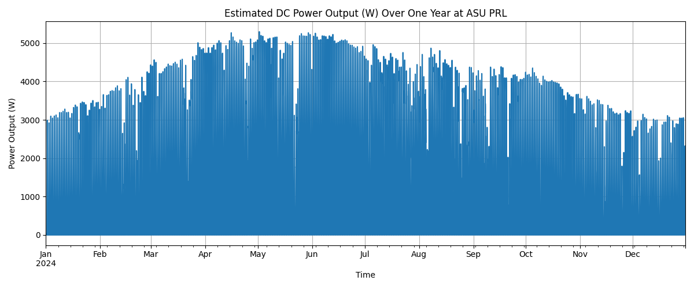

# PV Power Estimation at ASU PRL

Python script using [`pvlib`](https://pvlib-python.readthedocs.io/en/stable/) to estimate the **annual DC power output** of photovoltaic (PV) modules at the **ASU Photovoltaic Reliability Lab (PRL)** using **Typical Meteorological Year (TMY)** weather data.

---

## Purpose of the Script

This Python script estimates the DC power output of a photovoltaic (PV) system over a full year using historical weather data. It uses `pvlib`'s `pvwatts_dc` model to simulate output based on global horizontal irradiance (GHI) and air temperature. The location is Arizona State University PRL, and this tool supports planning, analysis, and educational use in solar energy modeling.

---

## Location

- **Latitude**: 33.4212  
- **Longitude**: -111.9330  
- **System Size**: 5 kW (DC)
- **Model Used**: `pvwatts_dc` (from `pvlib.pvsystem`)

---

## Tools & Libraries

- Python 3.x
- `pvlib`
- `pandas`
- `matplotlib`

---

## Output

The output is a plot showing hourly estimated DC power output over one year:



---

## ▶How to Run

1. **Clone this repo**:
   ```bash
   git clone https://github.com/yourusername/pv-power-estimation.git
   cd pv-power-estimation
